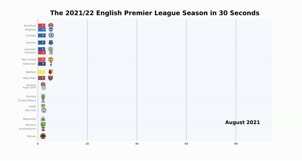
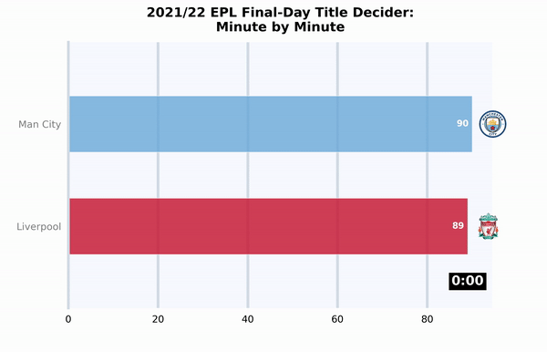

# Visualising EPL 21/22 Season Using Animated Bar Chart Race

The aim of this project is to create visualisations using animated bar chart race.  

# EPL 21/22 Season in 30 Seconds

# EPL 21/22 Final-Day Title Decider: Minute by Minute

# Useful Resources

Here are some useful resources in creating this visualisation:

- Data source: https://www.football-data.co.uk/englandm.php
- `bar_chart_race` documentation: https://www.dexplo.org/bar_chart_race/
- `bar_chart_race` GitHub page: https://github.com/dexplo/bar_chart_race
- Installation of ffmpeg: https://www.ffmpeg.org/download.html
- Installation of ImageMagick: https://imagemagick.org/

# Other Information

The visualisation was created based on data as of 19 May 2022.